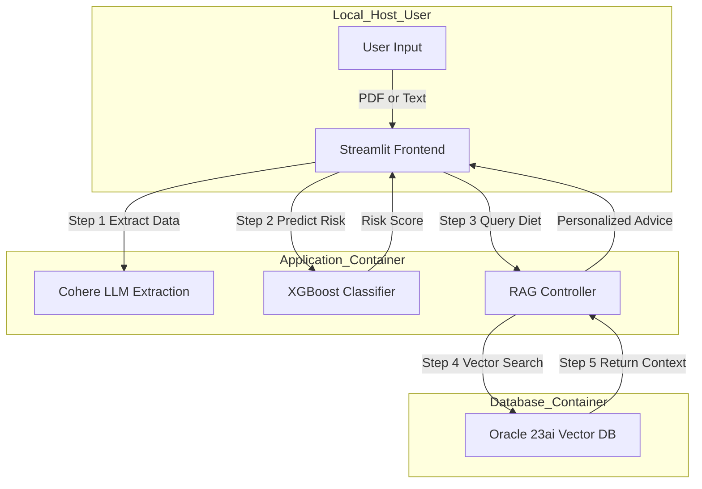

# 🩺 Diabet-AI: Clinical Risk Analysis & RAG Diet Assistant


---

## 📌 Project Overview

**Diabet-AI** is a full-stack automated healthcare assistant that integrates **Machine Learning** for clinical risk analysis with **Generative AI** for personalized lifestyle and diet guidance.

Unlike standard diabetes predictors, this system implements a **Retrieval-Augmented Generation (RAG)** pipeline powered by **Oracle Database 23ai**. The application does not merely output a risk score—it consults a vector database to generate **region-specific Indian diet recommendations**. For example, it suggests *Makki di Roti* for users in Punjab and *Jowar Bhakri* for users in Maharashtra, ensuring cultural and dietary relevance.

This project is designed to demonstrate **engineering maturity**: system architecture, ML pipelines, containerization, database orchestration, and secure deployment—not just model accuracy.

---

## 🏗️ System Architecture


```
## 🐳 Quick Start (Docker Hub)
Don't want to build from source? You can pull the pre-built production image directly from Docker Hub.

**Docker Hub Repository:** [agrimcommand/diabetes-assistant](https://hub.docker.com/r/agrimcommand/diabetes-assistant)

### Option 1: The "No-Code" Run
1. Create a folder and add a `.env` file with your `COHERE_API_KEY`.
2. Create a file named `docker-compose.yml` with the following content:

```yaml
services:
  diabetes-app:
    image: agrimcommand/diabetes-assistant:v1  # Pulls from Docker Hub
    container_name: diabetes-assistant
    ports:
      - "8501:8501"
    environment:
      - COHERE_API_KEY=${COHERE_API_KEY}
      - DB_DSN=oracle-db:1521/FREEPDB1
    depends_on:
      - oracle-db

  oracle-db:
    image: [container-registry.oracle.com/database/free:latest](https://container-registry.oracle.com/database/free:latest)
    container_name: oracle-db
    ports:
      - "1521:1521"
    environment:
      - ORACLE_PWD=mypassword123
    volumes:
      - oracle_data:/opt/oracle/oradata

volumes:
  oracle_data:
Run the application:
```
```
Bash

docker-compose up
(Docker will automatically download the 3.5GB App image and the 13GB Oracle Database image and wire them together.)
```
---

## 🚀 Key Engineering Pillars

### 1. 🧠 Prediction Engine (Machine Learning)

* **Model**: XGBoost (Extreme Gradient Boosting) optimized for structured clinical data.

* **Input Features**:

  * Glucose
  * Insulin
  * Blood Pressure
  * BMI
  * Age
  * Pregnancy Count

* **Pipeline Design**:

  * **Imputation**: `KNNImputer` intelligently handles missing or zero-value medical fields.
  * **Scaling**: `StandardScaler` normalizes features for stable model behavior.
  * **Inference Output**: Produces a **probabilistic risk score**, not a binary diagnosis.

This design aligns with real-world clinical decision support systems rather than simplistic classifiers.

---

### 2. 🗣️ RAG Pipeline (Generative AI)

* **Vector Database**: Oracle Database **23ai Free**, running as a dedicated Docker container.
* **Embeddings**: Generated using **Cohere `embed-english-v3.0`** (1024-dimensional vectors).
* **Retrieval Logic**:

  * Cosine similarity search over embedded regional diet profiles.
  * Top-matching regional context is retrieved from Oracle Vector Search.
* **Generation**:

  * Retrieved context is injected into **Cohere Command-R**.
  * The LLM produces medically aligned, empathetic, and culturally relevant diet advice.

This architecture cleanly separates **knowledge storage**, **retrieval**, and **generation**, mirroring production-grade GenAI systems.

---

### 3. 🛡️ DevOps & Infrastructure

* **Containerization**: Custom `Dockerfile` based on `python:3.12-slim` for reproducibility.
* **Orchestration**: `docker-compose` manages the multi-container lifecycle.
* **Service Discovery**: Application communicates with Oracle via internal DNS (`oracle-db`), not hardcoded IPs.
* **Networking**: Containers run on a private Docker bridge network.
* **Persistence**: Docker volumes (`oracle_data`) ensure vector embeddings persist across restarts.
* **Security**:

  * `.dockerignore` prevents secrets and unnecessary files from entering images.
  * API keys are injected at runtime via environment variables.

---

## 📸 Screenshots

| High Risk Diagnosis | Regional Diet (RAG) | DevOps Deployment |
| ------------------- | ------------------- | ----------------- |
| *Add screenshot*    | *Add screenshot*    | *Add screenshot*  |

---

## 🛠️ Installation & Deployment

This project is **fully containerized**. You do **not** need to install Python or Oracle locally.

### Prerequisites

* Docker Desktop (running)
* Cohere API Key (for LLM + embeddings)

---

### Step 1: Clone the Repository

```bash
git clone https://github.com/YOUR_USERNAME/Diabetes-Assistant.git
cd Diabetes-Assistant
```

---

### Step 2: Configure Environment

Create a `.env` file in the root directory:

```env
COHERE_API_KEY=your_actual_api_key_here
```

> ⚠️ **Do not commit this file.** It is excluded via `.dockerignore`.

---

### Step 3: Launch via Docker Compose

Build the application image and start all services:

```bash
docker-compose up --build
```

⏳ Wait ~60 seconds for Oracle Database initialization. Proceed only after seeing:

```
DATABASE IS READY TO USE
```

---

### Step 4: Initialize Knowledge Base (First Run Only)

Inject vector embeddings into Oracle 23ai:

```bash
docker exec -it diabetes-assistant python setup_rag.py
```

Expected output:

```
✅ All data inserted and embedded successfully!
```

---

### Step 5: Access the Application

Open your browser and navigate to:

👉 **[http://localhost:8501](http://localhost:8501)**

---

## 📂 Repository Structure

```plaintext
├── Dockerfile             # Python image build instructions
├── docker-compose.yml     # App + Oracle 23ai orchestration
├── app.py                 # Streamlit frontend
├── requirements.txt       # Frozen dependencies
├── setup_rag.py           # Vector embedding ETL pipeline
├── extractor.py           # LLM-based PDF/text extraction
├── predictor.py           # ML inference logic
├── run_pipeline.py        # RAG retrieval + generation logic
├── data.json              # Regional diet knowledge base
├── .dockerignore          # Security configuration
└── .env                   # API keys (not committed)
```

---

## 🔗 Connect

Developed by **Agrim Sharma**

If you're interested in **AI Engineering**, **MLOps**, **RAG systems**, or **healthcare technology**, feel free to connect on LinkedIn and discuss further.
